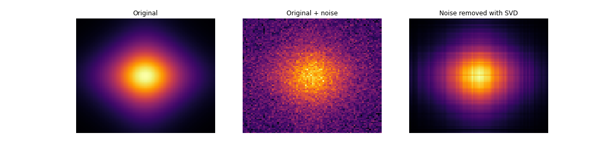
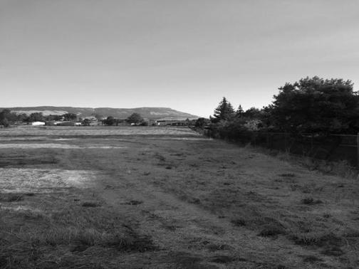
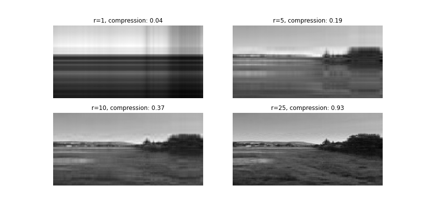
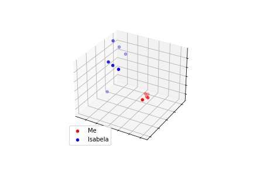

# The Backbone of Scientific Computing: The Singular Value Decomposition

Just as the same material can be used to construct different architectural structures, scientific computing and machine learning are fields of versatility; there are a few core operations used time and again, but in different ways. Perhaps none is more central to these fields than matrix decomposition. For instance, the [decompositional approach to matrix computations](https://dl.acm.org/doi/10.1109/5992.814658) is among [the top 10 algorithms of the 20th century](https://dl.acm.org/doi/10.5555/615603.615756)—a list that also included the [Fast Fourier Transform](https://en.wikipedia.org/wiki/Fast_Fourier_transform) and [Quicksort](https://en.wikipedia.org/wiki/Quicksort).

The main advantages of matrix decomposition (e.g., the [LU](https://en.wikipedia.org/wiki/LU_decomposition) and [QR](https://en.wikipedia.org/wiki/QR_decomposition) decompositions) is that they make practical numerical computation simpler and provide insights about the original data. The principal idea is to leverage the special properties of matrix factors (e.g., being [diagonal](https://en.wikipedia.org/wiki/Diagonal_matrix), [triangular](https://en.wikipedia.org/wiki/Triangular_matrix), [orthogonal](https://en.wikipedia.org/wiki/Orthogonal_matrix)/[unitary](https://en.wikipedia.org/wiki/Unitary_matrix), etc.) by rewriting a single matrix of numerical data as a product of other matrices.

Few matrix decompositions rival the [Singular Value Decomposition](https://en.wikipedia.org/wiki/Singular_value_decomposition) (SVD)—factoring a single data matrix into three matrices U, S, and Vt—in its ubiquity in data applications. The structure of these matrices enables approximations using smaller matrices for data compression, separation of important signals from noise, and generation of new data representations revealing key relationships. Among many others, here are some common applications of the SVD:

- [Denoising signals](https://en.wikipedia.org/wiki/Noise_reduction)
- [Data compression](https://en.wikipedia.org/wiki/Data_compression)
- [Principal Component Analysis](https://en.wikipedia.org/wiki/Principal_component_analysis) (PCA)
- [Regression analysis](https://en.wikipedia.org/wiki/Regression_analysis)
- Fluid simulation (i.e., through [Proper Orthogonal Decomposition](https://en.wikipedia.org/wiki/Proper_orthogonal_decomposition))
- [Recommendation systems](https://en.wikipedia.org/wiki/Recommender_system)

This is the first post in a series on the SVD. In this post, we'll briefly survey some common applications.

### Denoising

One important aspect of the SVD is that it allows extraction of the bulk of the information content buried in the data representing a signal—for instance, a time series or an image represented as a numerical matrix—that is contaminated by random noise. That is, the leading columns of a matrix factor may contain the dominant noise-free components. This idea underlies Principal Component Analysis (PCA) and other SVD-based techniques. The figure below figure provides an illustration:

The leftmost image (i.e., a data matrix) is noise-free. The middle image is contaminated with random noise. After computing the SVD of the noisy data matrix, the leftmost columns of U and the topmost rows of Vt contain most of the actual signal from the original data. Multiplying out those corresponding columns and rows has the effect of removing some of the noise. The rightmost image is the resulting SVD reconstruction with the noise partially removed.

### Compression

The fact that the leading columns of `U` and rows of `Vt`  summarizes the dominant information content of data well can be used for data compression as well as denoising. That is, storing fewer columns & rows suggests a scheme for saving memory, disk space, or network traffic. Below is a picture taken in eastern Oregon of a field with Mount Emily in the background:

Since this is a two-dimensional black and white image, we can apply the SVD directly. Just as before, we can use more or fewer columns/rows captured in the `U` /`Vt` matrices to reconstruct the original image. With fewer signals, the reconstruction is rather poor but the compression is quite good. As we use more signals, the image reconstructed improves at the cost of worse compression. In the figure below, we see four image reconstructions. The number `r` in the captions above each image shows the number of corresponding columns of `U` and rows of `Vt` that are used to produce the reconstruction. As we can see, we can generate a decent reconstruction using only `r=25` columns & rows.

The benefits of SVD-based compression have less to do with on-disk storage and more with tractable data transfers and computations. For example, the Dynamic Mode Decomposition (DMD) is an algorithm for analyzing high-dimensional time-series data. The SVD is used under-the-hood in the DMD algorithm for dimensionality reduction and compression. Without the SVD-based compression, the DMD computation is completely intractable for most real-world systems. Whether through the guise of PCA or otherwise, the SVD is often used to make computationally difficult problems into more tractable ones.

### Dimensionality Reduction

As we have seen in the last two examples, the SVD is one way we can decompose our data into different signals, some of which are more important than others. This is how we can remove noise and compress data. In many cases these signals can give us interesting insights into our data. Instead of using the variables we collect in our dataset, we can use the SVD to form a new set of variables. Like the cases of denoising and compression, we can opt to use a lower number of variables that capture the most important aspects of our data. This is called dimensionality reduction. Let's see how this works.

Below are a few pictures of me and a few pictures of Isabela,  who runs the [Jupyter community call](https://discourse.jupyter.org/t/jupyter-community-calls/668):

  
    

We can take each image and stretch it into a vector by concatenating each of the rows together. For these images, which are 150x300, this process results in vectors of length 4500. To form a matrix from these vectors we can stack them together as rows. I have 12 images in this set so the resulting short-wide matrix has the following dimensions: (12 faces, 45000 pixels). To visualize this large matrix, I took a small subsample of the columns (the actual matrix is much wider than shown below):

Right away we can see there are darker rows and brighter rows corresponding to two different people. We can be confident that most any classification model could easily learn to distinguish between these two sets of images. However, high-dimensional problems like this one pose computational challenges to fitting such a model. We can use the SVD to reduce the dimensionality of this problem. Here we'll compute the SVD of this matrix. The `Vt` matrix holds the signals corresponding to patterns between pixels within an image. We can project our data onto these patterns by multiplying our data matrix with `Vt.T` (e.g. `XV`). To reduce the number of dimensions, we'll just use 3 of the columns of `Vt.T`:

As we can see, there is clear separation between these sets of images along all three axes. It would be much less computationally intense to generate a classification model in this reduced space.

The signals captured by the SVD give us a new set of variables to use. Sometimes these signals are interpretable and correspond to identifiable features. Other times they pertain to complex patterns that are difficult to understand. In either case, projecting our data onto a small number of dominant signals can reduce the noise in our data, lighten the computational load, and give us insights about our data.

## Conclusion

I've outlined a few practical examples of using the SVD in science and industry. In the next few posts, I'll flesh out some mathematical details of using this matrix decomposition and provide some Python code so you can get started using it in your own applications.